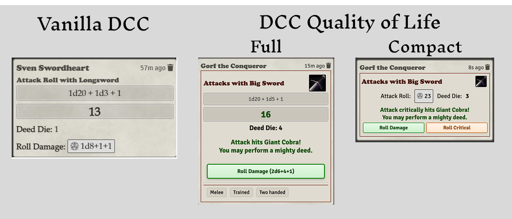

# DCC Quality of Life (dcc-qol)

A quality of life and automation module for the Dungeon Crawl Classics RPG system in Foundry VTT. This module aims to enhance gameplay by automating common mechanics, improving combat flow, and providing additional flexibily to DCC players and GMS. This version has been re-written from the ground up to support the 0.50+ version of the DCC RPG system, and Foundry VTT v12+.

## Overview

The DCC Quality of Life module aims to improve the DCC RPG experience in Foundry VTT by:

-   **Streamlining combat** - Let the system handle hit/miss determination, range penalties, mighty deed success/failure, and damage application
-   **Enforcing easily forgotten DCC rules** - Automatic friendly fire checks, firing into melee penalties, and luck modifiers on incoming crits & fumbles
-   **Supporting house rules and experimental variants** - DCC-QoL, as an optional add-on, has room to roam when it comes to support for other non-RAW/house rules options. More to come here soon!



## Key Features

### Combat Automation

#### **Enhanced Attack Cards**

-   **Hit/Miss Display**: Automatically shows whether an attack hits or misses when a target is selected
-   **Redesigned attack roll chat cards** with improved visual presentation and added information
-   Color-coded **roll damage, crit, and fumble buttons** for better feeling of player control


#### **Automatic Damage Application**

-   Automatic damage application to targeted tokens when damage is rolled
-   Respects token permissions and ownership -- only the attacking player or GM can roll damage
-   Visual confirmation of damage dealt - red animated text floating from the target shows the damage amount applied


#### **Range Checking & Penalties**

-   Automatic distance calculation using DCC diagonal movement rules
-   **Melee weapons**: Warning when target is beyond adjacent range
-   **Ranged weapons**: Automatic application of range penalties
    -   Medium range: -2 penalty to attack roll
    -   Long range: -1 die step penalty to action die (d20→d16)
    -   Out of range: Warning and confirmation dialog


#### **Friendly Fire System**

-   Automatic friendly fire checks when firing into melee (per DCC rules, page 96)
-   50% chance (d100 ≤ 50) of hitting an ally when attack misses in melee
-   Random target selection from available friendlies
-   Full attack resolution against friendly targets
-   Damage application workflow for friendly fire hits


#### **Firing Into Melee Penalties**

-   Automatic -1 penalty when using ranged weapons against targets engaged in melee
-   Smart detection of melee engagement based on token positioning and disposition (friendly/neutral/enemy)

#### **PC Luck Adjustments to Incoming Crits and Fumbles**

-   **Monster Crits vs Player Luck**: When a monster scores a critical hit against a PC, the PC's luck modifier is applied as a penalty to the monster's critical hit roll, reducing the severity of the critical
-   **Monster Fumbles vs Player Luck**: When a monster fumbles an attack against a PC, the PC's luck modifier affects the fumble die used for the fumble table roll

## Installation

1. **From Foundry's Module Browser:**

    - Search for "DCC Quality of Life" or "dcc-qol"
    - Click Install

2. **Manual Installation:**

    - Download the latest release from [GitHub releases](https://github.com/tonyrobots/dcc-qol/releases)
    - Extract to your Foundry `Data/modules/` directory
    - Enable in Foundry's Module Management interface

3. **Enable the Module:**
    - In your DCC world, go to Settings → Manage Modules
    - Check the box next to "DCC Quality of Life"
    - Save Module Settings

## Configuration

Access module settings through **Settings → Module Settings → DCC Quality of Life**.

[screenshot: showing module settings panel with all configuration options]

### Available Settings


| Setting                             | Description                                                           | Default |
| ----------------------------------- | --------------------------------------------------------------------- | ------- |
| **Automate Damage Apply**           | Automatically apply damage to targeted tokens when damage is rolled   | Enabled |
| **Automatic Friendly Fire**         | Perform friendly fire checks when firing into melee and attack misses | Enabled |
| **Firing Into Melee Penalty**       | Automatically apply -1 penalty when firing ranged weapons into melee  | Enabled |
| **Monster Critical vs Player Luck** | Apply player luck modifiers to reduce monster critical hit rolls      | Enabled |
| **Weapon Range Checking**           | Check weapon range and apply appropriate penalties automatically      | Enabled |

### Recommended Configuration

For the full DCC QoL experience, we recommend enabling all DCC QoL settings (enabled by default).

In addition, while dcc-qol will work with and respect all DCC system settings, we recommend **disabling** the following DCC RPG system settings for the optimal experience:

    ❌ Automate Damage/Crits/Fumbles
    ❌ Show rolls as emotes

## Technical Architecture

This module is transitioning from a legacy override-based system to a modern **hook-based architecture**:

-   **Event-Driven**: Responds to Foundry VTT and DCC system hooks, and only changes what's necessary
-   **Non-Intrusive**: No monkey-patching or function overrides means a far less brittle relationship to DCC system updates
-   **Modular**: Clean separation of concerns across feature files
-   **Extensible**: Easy to add new features without affecting existing functionality

### File Structure

```
scripts/
├── hooks/              # Hook-based event handlers
├── chatCardActions/    # Chat card button handlers
├── settings.js         # Module configuration
├── utils.js           # Utility functions
└── dcc-qol.js         # Main entry point
```

## Compatibility

-   **Foundry VTT**: v12 required (no v13 support yet, pending v13 support from DCC system)
-   **DCC RPG System**: Requires version 0.51.59
-   **Dice So Nice**: Full integration for 3D dice rolling
-   **Other Modules**: Should be fully compatible with any other modules, except those that modify the attack roll card

## Contributing

This module is open source and welcomes contributions:

-   **Bug Reports**: Use [GitHub Issues](https://github.com/tonyrobots/dcc-qol/issues)
-   **Feature Requests**: Discussion on [GitHub](https://github.com/tonyrobots/dcc-qol/discussions)
-   **Code Contributions**: [Pull requests](https://github.com/tonyrobots/dcc-qol/pulls) welcome
-   **Translations**: Help expand language support

## License

This module is licensed under the [MIT License](https://github.com/tonyrobots/dcc-qol/blob/main/LICENSE).

## Changelog

See [CHANGELOG.md](https://github.com/tonyrobots/dcc-qol/blob/main/CHANGELOG.md) for detailed version history.

---

_DCC Quality of Life is an independent module and is not affiliated with or endorsed by Goodman Games or the creators of the Dungeon Crawl Classics RPG._
